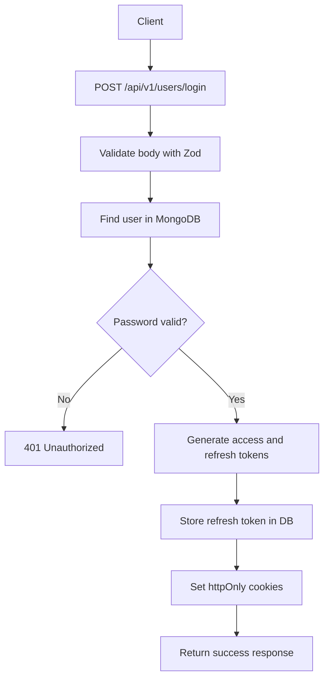
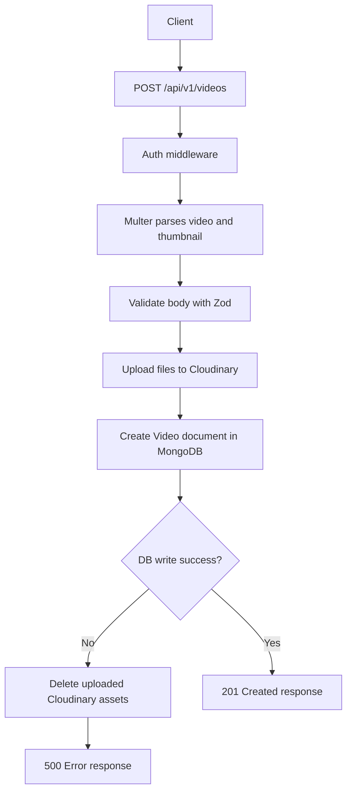
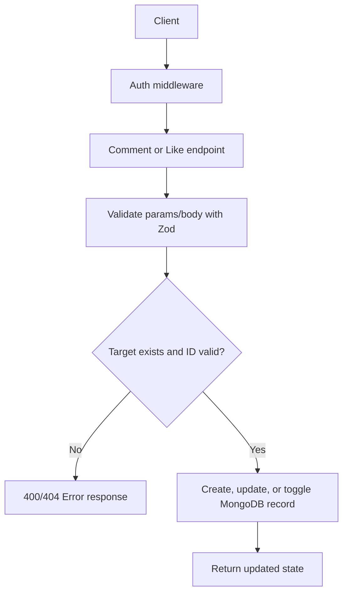

# Bilal Tube Backend

TypeScript backend for a YouTube-like app built with Express, MongoDB, JWT auth, Cloudinary uploads, and Zod validation.


## Why This Project Was Built

Bilal Tube backend was built as a real-world learning and portfolio project to practice production-style backend engineering instead of just basic CRUD demos.

The goal is to model the core building blocks of a modern media platform:

- secure authentication and session/token flow
- media upload and asset lifecycle handling
- feature-rich social interactions (tweets, comments, likes, subscriptions)
- modular architecture that can be maintained and extended

This project is intentionally designed to show backend depth: validation, middleware layering, API documentation, and domain-based route/controller separation.

## What It Demonstrates

This codebase demonstrates practical backend patterns used in professional Node.js projects:

- Type-safe API development with TypeScript and strict compiler settings
- Validation-first request handling using Zod schemas in `src/schema/`
- JWT auth flow with access and refresh token strategy
- Cloudinary integration for media upload and cleanup
- Mongoose data modeling for multi-entity relationships
- OpenAPI generation from source schemas for up-to-date docs

## Why You Should Care

If you are hiring, reviewing, or learning from this project, it shows more than just endpoint creation.

- It proves end-to-end API thinking, from request validation to response contracts.
- It shows maintainability practices: modular folders, reusable request types, and centralized config.
- It includes developer experience improvements: Swagger docs, typed schemas, and predictable scripts.

In short, this project is a backend engineering showcase that balances learning goals with practical architecture.

## What This Project Includes

- User authentication and profile management
- Video publish, update, delete, views, and listing
- Tweets, comments, likes, subscriptions, playlists, dashboard stats
- File uploads with Multer + Cloudinary
- OpenAPI docs powered by Zod schemas and Swagger UI

## Api Documentation

- Swagger UI: `/api-docs`


## Tech Stack

- Runtime: Node.js
- Language: TypeScript
- Framework: Express 5
- Database: MongoDB + Mongoose
- Validation: Zod
- Auth: JWT + httpOnly cookies
- Uploads: Multer + Cloudinary
- Docs: `@asteasolutions/zod-to-openapi` + `swagger-ui-express`
- Package manager: pnpm

## Project Structure

```text
src/
  app.ts
  index.ts
  config/
  controllers/
  docs/
  middlewares/
  models/
  routes/
  schema/
  types/
  utils/
```

## Getting Started

1. Clone and open the project.
2. Install dependencies:

```bash
pnpm install
```

1. Create `.env` in project root.
2. Run development server:

```bash
pnpm dev
```

1. Build and run production:

```bash
pnpm build
pnpm start
```

## Docker Setup (Step by Step)

This project includes a production-ready multi-stage `Dockerfile`.

### 1. Install Docker

Use the official Docker installation docs for your OS:

- <https://docs.docker.com/engine/install/>

Quick check after installation:

```bash
docker --version
```

### 2. Prepare Environment Variables

Create a `.env` file in the project root (same directory as `Dockerfile`).

Minimum required values:

```env
PORT=3000
MONGO_URI=mongodb://host.docker.internal:27017/bilal-tube

CLIENT_URL=http://localhost:5173
OPENAPI_SERVER_URLS=http://localhost:3000

ACCESS_TOKEN_SECRET=your_access_token_secret
ACCESS_TOKEN_EXPIRY=1d
REFRESH_TOKEN_SECRET=your_refresh_token_secret
REFRESH_TOKEN_EXPIRY=7d

CLOUD_NAME=your_cloudinary_cloud_name
CLOUDINARY_API_KEY=your_cloudinary_api_key
CLOUDINARY_API_SECRET=your_cloudinary_api_secret

NODE_ENV=production
```

Note:

- `host.docker.internal` is useful when MongoDB runs on your host machine.
- On Linux, if `host.docker.internal` is unavailable, use your host IP.

### 3. Build Docker Image

From the project root:

```bash
docker build -t bilal-tube-backend:latest .
```

### 4. Run Container

```bash
docker run -d \
  --name bilal-tube-backend \
  --env-file .env \
  -p 3000:3000 \
  bilal-tube-backend:latest
```

### 5. Verify the App Is Running

Check container status:

```bash
docker ps
```

Check logs:

```bash
docker logs -f bilal-tube-backend
```

Test health endpoint:

```bash
curl http://localhost:3000/api/v1/healthcheck
```

### 6. Stop and Remove Container

```bash
docker stop bilal-tube-backend
docker rm bilal-tube-backend
```

### 7. Rebuild After Code Changes

```bash
docker build -t bilal-tube-backend:latest .
docker stop bilal-tube-backend && docker rm bilal-tube-backend
docker run -d --name bilal-tube-backend --env-file .env -p 3000:3000 bilal-tube-backend:latest
```

## Scripts

- `pnpm dev` -> Run with `tsx` in development
- `pnpm build` -> Compile TypeScript to `dist/`
- `pnpm start` -> Run compiled server
- `pnpm lint` -> Format source files with Prettier

## Environment Variables

Create `.env` and set these values:

```env
PORT=3000
MONGO_URI=mongodb://localhost:27017/bilal-tube

CLIENT_URL=http://localhost:5173
OPENAPI_SERVER_URLS=http://localhost:3000,https://api.example.com

ACCESS_TOKEN_SECRET=your_access_token_secret
ACCESS_TOKEN_EXPIRY=1d
REFRESH_TOKEN_SECRET=your_refresh_token_secret
REFRESH_TOKEN_EXPIRY=7d

CLOUD_NAME=your_cloudinary_cloud_name
CLOUDINARY_API_KEY=your_cloudinary_api_key
CLOUDINARY_API_SECRET=your_cloudinary_api_secret

NODE_ENV=development
```

Notes:

- `OPENAPI_SERVER_URLS` accepts multiple comma-separated URLs.
- If `OPENAPI_SERVER_URLS` is not set, docs default to `http://localhost:3000`.

## API Base URL

`/api/v1`

## API Docs

- Swagger UI: `/api-docs`
- OpenAPI JSON: `/openapi.json`

Example local URLs:

- `http://localhost:3000/api-docs`
- `http://localhost:3000/openapi.json`

## Route Groups

- `/healthcheck`
- `/users`
- `/tweets`
- `/subscriptions`
- `/videos`
- `/comments`
- `/likes`
- `/playlist`
- `/dashboard`

All route mounts are defined in `src/app.ts`.

## Quick Health Check

After starting the server:

- `GET /` -> welcome text
- `GET /api/v1/healthcheck` -> service health endpoint

## Development Notes

- Request validation schemas live in `src/schema/`.
- Controllers consume those schemas for safer runtime validation.
- Auth middleware reads JWT from cookies or `Authorization: Bearer <token>`.

## Flow Diagrams

To keep the architecture easy to understand, the system flow is split into smaller diagrams instead of one large chart.

### 1. Authentication Flow



### 2. Video Publish Flow



### 3. Engagement Flow (Comments and Likes)



## License

ISC
